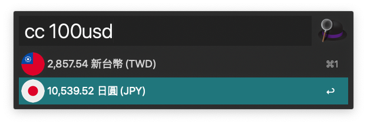

# Currency Conversion
在 Alfred 上使用貨幣轉換，類似內建的 Spotlight 的功能

## 安裝
下載 [Currency-Conversion.alfredworkflow](Currency-Conversion.alfredworkflow) 後點擊，即可匯入 Alfred workflow，因為程式是使用 php 撰寫的，電腦必須有可執行 php 的環境，基本上 MacOS 上都會有 php

## 用法
在 Alfred 中輸入下面指令，即可看到貨幣轉換的結果

```
cc 100 usd
```

`cc` 則是此應用程式的關鍵字，有這關鍵字才能處發



## 如何開發
[Alfred](https://www.alfredapp.com/)  應用程式路徑 `~/Library/Application\ Support/Alfred/Alfred.alfredpreferences/workflows/` 下有 workflow 資料夾會有一個長得像 `user.workflow.<UUID>` 的資料夾，程式的相關資源都在該資料夾底下

或是

clone 此專案、安裝套件後，即可在終端機輸入下面指令，跟使用 Alfred 觸發的結果是一樣的
```shell
$ php index.php "100 usd"
```

支援貨幣如 [config.php](config.php) 檔案，更詳細的內容可以參考 [API 文件](https://www.exchangerate-api.com/docs/supported-currencies)

使用的 API 如下
```
https://api.exchangerate-api.com/v4/latest/{base}
```
